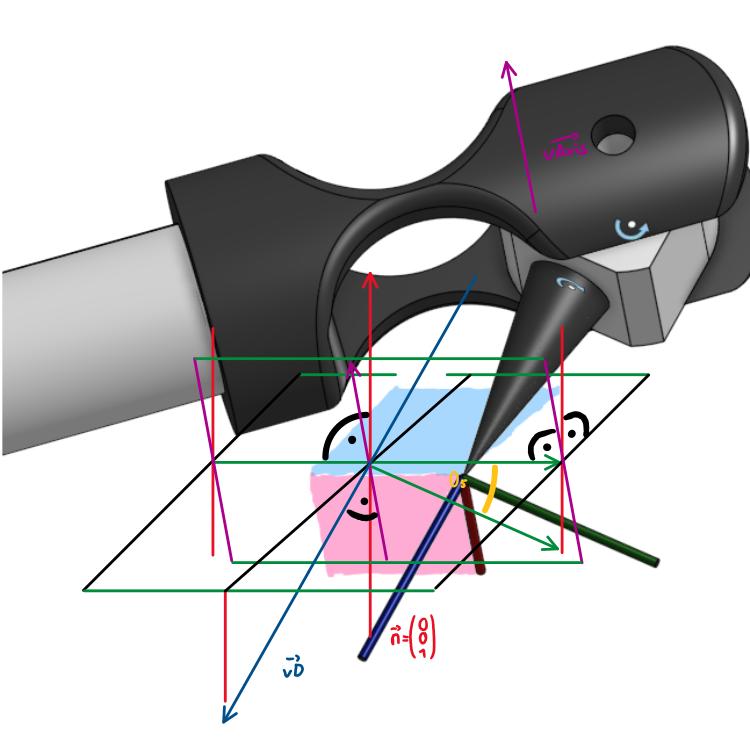

# Robot Arm - Label

### Angles

- $\Theta_0, \Theta_1, \Theta_2, \Theta_3, \Theta_4, \Theta_5$
- The default position where every $\Theta_n$ as an angle of $0°$ is shown in the bottom right of the visualization
- Depending on the relative rotation perspective, the angles might have to be inverted $\Theta_n*(-1)$.

### Arm Segments

- $L_0, L_1, L_2, L_3, L_4, L_5$

- Every Length of each 6x Arm Segments

- $\vec{L_2}, \vec{L_3}$ are collinear because, they both rotate to each other around their own axis
  
  ##### Arm Vectors
  
  - $\vec{v_{L0}}, \vec{v_{L1}}, \vec{v_{L2}}, \vec{v_{L3}}, \vec{v_{L4}}, \vec{v_{L5}}$
  
  - These vectors have the length of the corresponding arm segments, and point in the arm direction, where the $\Theta_n$ rotation center the origin of the vector is.

### Point and Direction

- $\vec{v_P}$
  
  - Vector Point: Destination Point in 3D space at which the tip should point at

- $\vec{v_D}$
  
  - Vector Direction: Direction at which the arm should point onto the destination Point represented by the $\vec{v_P}$ 

---

# Inverse Kinematics

## $\vec{vQ}​$ - Introduction

$$
\vec{v_Q}=\vec{v_P}-\vec{v_D}-\begin{pmatrix}0\\0\\L_0+L_1\end{pmatrix}
$$

$\vec{vQ}$ is the the direct Vector from the rotation center of $\Theta_1$ to $\Theta_4$ and is always in a normal plane with the normal vector:

$$
\vec{n}=\begin{pmatrix}x\\y\\0\end{pmatrix}
$$

This puts a part of the arm into two dimensions, which is later useful to calculate the desired rotation angle $\Theta_1, \Theta_2$

## $\Theta_0$ - Rotation

The Rotation Angle $\Theta_0$ is the projection of the $\vec{v_Q}$ onto the $\text{x-y}$ Plane, which then can be broken down into a triangle in which we can calculate the $\Theta_0$.

Now that we have a triangle we can calculate the angle in a range from $0°$up to $360°$ with the help of the atan2 function:

$$
\Theta_0=tan2^{-1}(\frac{v_{Qx}}{v_{Qy}})
$$

## $2D$ - Wrist Position

Since the $\vec{vQ}$ made a part of the arm into a 2D plane, we can solve for $\Theta_1, \Theta_2$ with the help of some geometry and a triangle.

$$
\left| 
\begin{array}{r}
 (x*|\vec{v_Q}|)^2+h^2=L_2^2 \\
 ((1-x)*|\vec{v_Q}|)^2+h^2=(L_3+L_4)^2
\end{array}
\right|
$$

$$
\left| 
\begin{array}{r}
 h^2=L_3^2-(x*|\vec{v_Q}|)^2 \\
 h^2=(L_4+L_5)^2-((1-x)*|\vec{v_Q}|)^2
\end{array}
\right|
$$

$$
L_2^2-(x*|\vec{v_Q}|)^2=(L_3+L_4)^2-((1-x)*|\vec{v_Q}|)^2\ |\ solve\ x
$$

$$
x=\frac{|\vec{v_Q}|^2+L_2^2-(L_3+L_4)^2}{2*|\vec{v_Q}|^2}
$$

With these two Pythagorean theorem equations we get the factor $x$ which scales the $\vec{vQ}$ into the left and right length on the bottom of $h$, which allows us to calculate the assisting angles $\alpha, \beta, \gamma$ and the line $h$.

$$
h=\sqrt{L_2^2-(x*|\vec{vQ}|)^2}
$$

$$
\alpha=tan2^{-1}(h,(x*|\vec{vQ}|))
$$

$$
\beta=tan2^{-1}(\sqrt{vQ_x^2+vQ_y^2},vQ_z)
$$

$$
\gamma=tan2^{-1}(h,(1-x)*|\vec{vQ}|)
$$

Now, that we have the assisting angles, we can just add and subtract them to get the desired angles $\Theta_1,\Theta_2$.

$$
\Theta_1=\beta-\alpha
$$

$$
\Theta_2=\alpha+\gamma
$$

### $\Theta_3, \Theta_4, \Theta_5$ - Tip Rotation

In comparison the last three rotation angles are a bit more complicated to calculate and a bit abstract. Here we primarily rely on pure Vector angle calculation.

$\Theta_3,\Theta_4$ are used to set the direction of the $\vec{v_D}$ direction vector. $\Theta_5$ is then later only used to level the cross axis of the tip.

##### Vector Angle $0°$- $360°$ with $\vec{n}$

Normally the angle between two vectors is only between $0°$ and $180°$, because we have no way of differentiate between a $45°$ or $-45°=315°$  angle because it is the same from the front and/or back perspective. By adding a set $\vec{n}$ we can look at both vectors from one side and therefore determine if the angle is greater or less then $180°$

First we calculate the angle between $\vec{a}$ and $\vec{b}$ in the common way:

$$
\Theta=cos^{-1}(\frac{\vec{a}*\vec{b}}{|\vec{a}|*|\vec{b}|})
$$

Then we rotate $\vec{a}$ ,  $\pm\Theta$ degrees around $\vec{n}$ with the [Rodrigues' rotation formula]([Rodrigues' rotation formula - Wikipedia](https://en.wikipedia.org/wiki/Rodrigues%27_rotation_formula)) and subtract both new normed vectors  from the normed $\vec{b}$. The one with a length of  $\approx0$ is the rotated vector $\vec{a}$ to $\vec{b}$ and therefore has the right rotation of  $\pm\Theta$.

$$
\vec{a_{\pm\Theta}}=\vec{a}*cos(\Theta)+(\vec{n}\times\vec{a})*sin(\Theta)+\vec{n}*(\vec{n}*\vec{a})*(1-cos(\Theta))

$$

$$
|\vec{b}-\vec{a_{+\Theta}}|\approx0\rightarrow+\Theta
\\
|\vec{b}-\vec{a_{-\Theta}}|\approx0\rightarrow-\Theta
$$

Note: If you create the $\vec{n}$ with the cross product  $\vec{a}\times\vec{b}$ , $\Theta$ will be between $0°$ and $180°$ and not greater then $180°$.

In the following documentation this method will be referred with

$$
\Theta=vAn(\vec{a},\vec{b},\vec{n})
$$

##### $\Theta_3$ - Rotation

The $\Theta_3$ Rotation is the angle between the horizontal $\Theta_4$ rotation Axis and the actual $\Theta_4$ rotation axis which is the horizontal one, rotated $\Theta_3$ degrees around the $\vec{v_{L3}}$ or $\vec{v_{L4}}$ axis.

The horizontal axis which we call $\vec{v_{Hor}}$ has the same direction as the $x\text{-Axis}$ vector rotated $\Theta_0$ degrees around the $z\text{-Axis}$.

$$
\begin{pmatrix}1\\0\\0\end{pmatrix}
\xrightarrow{\Theta_0\ arnd.\ \begin{pmatrix}0\\0\\1\end{pmatrix}}
\vec{v_{Hor}}
$$

The actual $\Theta_4$ rotation axis vector $\vec{v_{Axis}}$ is the cross product of the $\vec{v_D}$ or $\vec{v_5}$ and the $\vec{v_{L3}}$ or $\vec{v_{L4}}$.

$$
\vec{v_{Axis}}=\vec{v_D}\times\vec{v_{L3}}
$$

Now that we have both the $\vec{v_{Hor}}$ and $\vec{v_{Axis}}$ which both lay in the same normal rotation plane with a $\vec{n}$ of $\vec{v_{L3}}$ or $\vec{v_{L4}}$ we can calculate the angle between both vectors with the described vector angle function.

$$
\Theta_3=vAn(\vec{v_{Hor}},\vec{v_{Axis}},\vec{v_{L3}})
$$

##### $\Theta_4$ - Rotation

The $\Theta_4$ rotation angle is the one between $\vec{v_{L3}}$ and $\vec{v_D}$ with $\vec{v_{Axis}}$ as the $\vec{n}$.

But since $\vec{v_{Axis}}$ was created via a cross product we have to recreate it with the rotation of $\vec{v_{Hor}}$ $\Theta_3$ degrees around the $\vec{v_{L3}}$ axis, else we only get an angle in the range of $0°$ up to $180°$.

$$
\vec{v_{Hor}}
\xrightarrow{\Theta_3\ arnd.\ \vec{v_{L3}}}
\vec{v_{Axis}}
$$

$$
\Theta_4=vAn(\vec{v_{L3}},\vec{v_D},\vec{v_{Axis}})
$$

##### $\Theta_5$ - Rotation

The last angle is only for the rotation of the $\vec{v_{L5}}$ around it's own axis and therefore doesn't really matter for the position or direction of the robot arm tip.

The only really practical thing to do with it, is to calculate the angle in a way that the fixed cross axis of the $\vec{v_{L5}}$ is horizontally aligned.

We can construct two normal planes which intersection vector is the horizontal aligned cross vector, rotated around the $\vec{v_D}$.

$$
E_1:\begin{pmatrix}0\\0\\1\end{pmatrix}*\vec{x}=0
$$

$$
E_1:\vec{v_D}*\vec{x}=0
$$

Also the horizontal $\vec{x}$ we are looking for has an $\text{Z-Coord}$ of 0, because it lays inside the $\text{x-y}$ Plane. If we no equate the both planes (both are equal to zero) and insert our $\vec{x}$ we get this vector:

$$
x_z = \vec{v_{Dx}} * x_x + \vec{v_{Dy}} * x_y + \vec{v_{Dz}} * x_z
$$

$$
\Leftrightarrow 0 = \vec{v_{Dx}} * x_x + \vec{v_{Dy}} * x_y\ |\ solve\ x_x, x_y
$$

$$
\vec{x}=\begin{pmatrix}\frac{-v_{Dy}*x_y}{v_{Dx}}\\x_y\\0\end{pmatrix}
\rightarrow
\begin{pmatrix}\frac{-v_{Dy}}{v_{Dx}}\\1\\0\end{pmatrix}
$$

This vector rotated $\Theta_5$ degrees around $\vec{v_D}$ is the same as the one of the cross product of $\vec{v_D}$ and $\vec{v_{Axis}}$ from the $\Theta_4$ calculation, we call it $\vec{v_{\Theta_5}}$.

$$
\vec{v_{\Theta_5}}=\vec{v_D}\times\vec{v_{Axis}}
$$

$\Theta_5$ is the angle between $\vec{v_{\Theta_5}}$ and $\vec{x}$.

$$
\Theta_5=vAn(\vec{\vec{x},v_{\Theta_5}},\vec{v_D})
$$

In one special case $x_x=\infty$ and $x_y=1$, which is the same as $x_x=1$ and $x_y=0$. With this replacement we can calculate the angle of this one special case.

---

# Forward Kinematics

COMMING SOON
